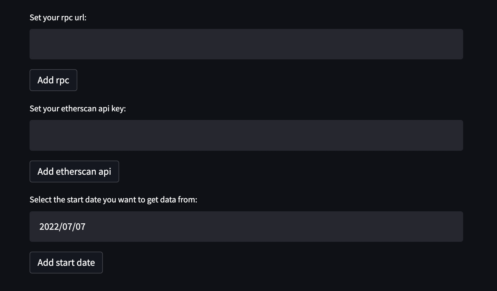

# Ethereum bridge outflows
 Python project to track token outflows from Ethereum blockchain based on Anyswap and Synapse protocols

# Instructions

1) Clone repo
2) cd eth-bridge-outflows
3) python3 -m venv my_venv
4) source ./my_venv/bin/activate
5) pip3 install -r ./requirements.txt
6) python3 -m streamlit run main.py
7) Enter your RPC URL, Etherscan API, and the date you want to download data from

(Historical data takes longer to run depending on how far back you run it).